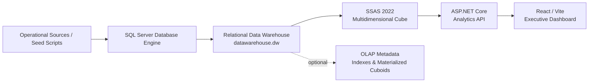

<h1 align="center">Vietnam Retail Data Warehouse & SSAS OLAP Analytics</h1>

<p align="center">
  <b>End-to-end retail analytics platform with SQL Server Data Warehouse, SSAS Multidimensional Cube, ASP.NET Core API, and React Executive Dashboard.</b>
</p>

<p align="center">
  <a href="#tổng-quan">Tổng quan</a> •
  <a href="#kiến-trúc">Kiến trúc</a> •
  <a href="#mô-hình-dữ-liệu">Mô hình dữ liệu</a> •
  <a href="#ssas-olap-cube">SSAS Cube</a> •
  <a href="#dashboard--olap-exploration">Dashboard</a> •
  <a href="#hướng-dẫn-chạy-local">Run local</a>
</p>

<p align="center">
  
  
  
  
  
</p>

---

## Tổng Quan

**Vietnam Retail Data Warehouse & SSAS OLAP Analytics** là một dự án phân tích dữ liệu bán lẻ theo hướng end-to-end. Hệ thống mô hình hoá dữ liệu bán hàng và tồn kho thành Data Warehouse trên SQL Server, triển khai SSAS 2022 Multidimensional Cube để phục vụ OLAP analytics, cung cấp lớp ASP.NET Core API để truy vấn dữ liệu phân tích, và hiển thị kết quả qua React/Vite Executive Dashboard.

Dự án tập trung vào hai miền phân tích chính: **Sales analytics** và **Inventory snapshot analytics**. Người dùng có thể theo dõi KPI điều hành, phân tích doanh thu/tồn kho theo thời gian và khu vực, drill down / roll up trực tiếp trên biểu đồ, slice/dice bằng quick filters và context filters, đồng thời xem phân tích 2 chiều dạng pivot trong trang Advanced Analysis.

Dự án phù hợp để trình bày trong:

- GitHub portfolio cho hướng Data Engineering / BI Engineering.
- Báo cáo môn Data Warehouse, OLAP hoặc Business Intelligence.
- Technical interview discussion về dimensional modeling, SSAS cube, analytics API và dashboard design.

## Điểm Nổi Bật

- **SQL Server relational Data Warehouse** với schema `dw`.
- **Star-schema style model** gồm các bảng Fact và Dimension rõ ràng.
- **SSAS 2022 Multidimensional Cube** cho OLAP analytics.
- **Sales analytics**: doanh thu, sản lượng bán, tăng trưởng doanh thu, breakdown theo thời gian/khu vực.
- **Inventory snapshot analytics**: tồn kho trung bình, tăng/giảm tồn kho, khu vực/cửa hàng tồn kho cao.
- **Interactive Dashboard** cho business users với dark navigation, white cards, KPI cards và charts.
- **Drill down / roll up** qua chart click và breadcrumb.
- **Slice/dice** qua quick time filters và Time + Location context.
- **2D comparison / pivot-style analysis** ở trang Advanced Analysis.
- **Metadata/index/cuboid support** tại SQL Server Database Engine layer:
  - DW indexes.
  - optional OLAP/columnstore indexes.
  - metadata tables.
  - materialized cuboid scripts.

## Kiến Trúc



Luồng chạy local:

1. SQL Server Database Engine chạy bằng Docker tại `localhost,1433`.
2. Python scripts tạo schema Data Warehouse và seed dữ liệu bán lẻ.
3. SSAS project đọc dữ liệu từ relational Data Warehouse.
4. SSAS database/cube được deploy và process trên host Windows.
5. ASP.NET Core API truy vấn SSAS.
6. React frontend gọi API để hiển thị dashboard và màn hình phân tích.

### Visual Assets

> Screenshot/diagram có thể được thêm sau tại `docs/assets/data-warehouse-architecture.png`.
>
> Target path cho hình SQL Server indexes: `docs/assets/sql-server-indexes.png`.

## Công Nghệ Sử Dụng

| Layer | Technology |
|---|---|
| Database Engine | SQL Server 2022 Docker image |
| Data Warehouse scripts | Python, pyodbc, Faker, pandas |
| OLAP Engine | SQL Server Analysis Services 2022 Multidimensional |
| Analytics API | ASP.NET Core 8, Swagger/OpenAPI |
| Frontend | React 18, Vite, TypeScript, React Router |
| Local tooling | Docker Desktop, .NET SDK 8, Node.js, ODBC Driver 18 |

## Mô Hình Dữ Liệu

Data Warehouse sử dụng mô hình dimensional/star-schema style với 4 dimension chính và 2 fact table.

### Dimension Tables

| Table | Vai trò |
|---|---|
| `dw.dim_time` | Thời gian phân tích theo tháng, quý, năm |
| `dw.dim_product` | Sản phẩm, mã hàng, mô tả, kích cỡ, trọng lượng |
| `dw.dim_store` | Cửa hàng, thành phố, bang/khu vực, địa chỉ |
| `dw.dim_customer` | Khách hàng, địa lý, subtype khách du lịch/bưu điện |

### Fact Tables

| Table | Grain | Measures |
|---|---|---|
| `dw.fact_sale` | Product x Time x Store x Customer | `soluongban`, `tongtien` |
| `dw.fact_inventory_snapshot` | Time x Store x Product | `soluongtonkho` |

### ERD / Warehouse Diagram

> Hình ERD/Data Warehouse architecture có thể đặt tại:
>
> `docs/assets/data-warehouse-architecture.png`
>
> Khi file này tồn tại, có thể hiển thị bằng:
>
> ```markdown
> 
> ```

Script chính:

| File | Mục đích |
|---|---|
| `data/build_dw.py` | Tạo database/schema, tables, keys và constraints |
| `data/seed_dw.py` | Seed dữ liệu demo cơ bản |
| `data/seed_dw_2022_2025.py` | Seed dữ liệu nhiều năm phục vụ dashboard và growth/change KPI |
| `run_tests.py` | Chạy bộ kiểm tra Data Warehouse |
| `data/test_dw_business.py` | Tạo business validation report |

## SSAS OLAP Cube

SSAS Multidimensional project nằm tại:

```text
olap/RetailAnalytics_SSAS/
```

Cấu hình hiện tại:

| Thành phần | Giá trị |
|---|---|
| SSAS server | `localhost` |
| Catalog/database | `RetailAnalytics_SSAS` |
| Cube | `Retail Analytics Cube` |
| SQL Server Database Engine | `localhost,1433` |
| Relational database | `datawarehouse` |

Cube hiện có 2 measure group chính:

| Measure Group | Source fact | Measures |
|---|---|---|
| `Fact Sale` | `dw.fact_sale` | `Soluongban`, `Tongtien` |
| `Fact Inventory Snapshot` | `dw.fact_inventory_snapshot` | `Inventory Quantity Sum`, calculated measure `Inventory Average Quantity` |

Dimension usage:

| Dimension | Sales | Inventory Snapshot |
|---|---|---|
| Time | Regular | Regular |
| Product | Regular | Regular |
| Store | Regular | Regular |
| Customer | Regular | Không áp dụng |

Hierarchies chính:

- Time: `Nam -> Quy -> Thang`.
- Store/Location: `Bang -> Thanhpho -> Macuahang`.
- Customer: geography/type attributes.

> Screenshot SSAS aggregations/cube browser có thể thêm sau tại `docs/assets/ssas-aggregations.png`.

## Analytics API

API nằm tại:

```text
apps/analytics-api/
```

API đóng vai trò backend analytics layer giữa dashboard và SSAS cube. Frontend không đọc trực tiếp SQL Server fact tables.

### Main Endpoints

| Endpoint | Mục đích |
|---|---|
| `GET /api/health` | Kiểm tra API và trả về SSAS config đang dùng |
| `GET /api/metadata/overview` | Đọc metadata cube/dimensions/measures từ SSAS |
| `GET /api/metadata/smoke-test` | Smoke test kết nối và measure SSAS |
| `GET /api/sales/summary/by-year` | Tổng hợp doanh thu theo năm |
| `GET /api/sales/time-breakdown` | Breakdown doanh thu theo năm/quý/tháng |
| `GET /api/sales/store-breakdown` | Breakdown doanh thu theo bang/thành phố/cửa hàng |
| `GET /api/sales/pivot` | Ma trận doanh thu theo thời gian và khu vực |
| `GET /api/inventory/summary/by-year` | Tồn kho trung bình theo năm |
| `GET /api/inventory/time-breakdown` | Breakdown tồn kho theo năm/quý/tháng |
| `GET /api/inventory/store-breakdown` | Breakdown tồn kho theo bang/thành phố/cửa hàng |
| `GET /api/inventory/pivot` | Ma trận tồn kho theo thời gian và khu vực |

Swagger local:

```text
http://localhost:5056/swagger
```

Health check:

```text
http://localhost:5056/api/health
```

## Dashboard & OLAP Exploration

Frontend nằm tại:

```text
apps/web/
```

Các màn hình chính:

| Route | Mục đích |
|---|---|
| `/` | Executive dashboard: KPI doanh thu, sản lượng, tăng trưởng, tồn kho |
| `/sales` | Sales analysis theo thời gian và khu vực |
| `/inventory` | Inventory analysis theo thời gian và khu vực |
| `/advanced` | 2D comparison / pivot-style analysis |

### Dashboard Capabilities

- KPI cards cho business users.
- Quick time filter: `Toàn kỳ`, `2022`, `2023`, `2024`, `2025`.
- Time context và Location context đồng bộ giữa các biểu đồ.
- Drill down từ năm xuống quý, từ quý xuống tháng.
- Drill down từ bang/khu vực xuống thành phố, từ thành phố xuống cửa hàng.
- Roll up và clear filters bằng breadcrumb/context buttons.
- Advanced Analysis hiển thị ma trận 2 chiều theo năm và khu vực.

### Screenshot Placeholders

> Dashboard overview screenshot: `docs/assets/dashboard-overview.png`.
>
> Sales analysis screenshot: `docs/assets/sales-analysis.png`.
>
> Inventory analysis screenshot: `docs/assets/inventory-analysis.png`.
>
> Nếu các file trên chưa có trong repo, có thể thêm sau mà không cần đổi cấu trúc README nhiều.

## Metadata, Indexes & Materialized Cuboids

Repo có thêm các script SQL phục vụ demo và tối ưu ở SQL Server Database Engine layer. Đây là phần bổ trợ cho Data Warehouse/OLAP, không thay thế SSAS cube.

| Script | Vai trò |
|---|---|
| `data/create_advanced_indexes.sql` | Rowstore/composite/covering indexes cho query nghiệp vụ trên DW |
| `data/create_olap_indexes.sql` | Optional columnstore indexes cho workload scan-heavy/OLAP |
| `data/create_materialized_cuboids.sql` | Tạo physical aggregate cuboid tables trong schema `olap` |
| `data/create_olap_metadata.sql` | Tạo metadata mô tả cuboids và SSAS conceptual objects |
| `data/verify_olap_cuboids.sql` | Xác minh số lượng cuboid tables và smoke test một số cuboid |

Materialized cuboid layer nếu chạy script sẽ tạo:

| Subject area | Dimensions | Cuboids |
|---|---|---|
| Sales | Time, Product, Store, Customer | 16 |
| Inventory | Time, Product, Store | 8 |
| Total | - | 24 |

> Screenshot SQL Server indexes có thể thêm sau tại `docs/assets/sql-server-indexes.png`.

## Cấu Hình Local

Tạo `.env` từ `.env.example` tại repo root.

Ví dụ:

```env
SA_PASSWORD=YourStr0ng!Passw0rd
MSSQL_HOST=localhost
MSSQL_PORT=1433
MSSQL_DB=datawarehouse
MSSQL_SCHEMA=dw
MSSQL_DRIVER=ODBC Driver 18 for SQL Server
SQLSERVER_PORT=1433
SSAS_SERVER=localhost
SSAS_CATALOG=RetailAnalytics_SSAS
SSAS_CUBE=Retail Analytics Cube
```

Lưu ý quan trọng:

- `docker-compose.yml` đọc `MSSQL_SA_PASSWORD`.
- Python scripts đọc `SA_PASSWORD`.
- Nên khai báo cả hai biến cùng một giá trị nếu chạy Docker + Python từ đầu.

```env
SA_PASSWORD=YourStr0ng!Passw0rd
MSSQL_SA_PASSWORD=YourStr0ng!Passw0rd
```

## Hướng Dẫn Chạy Local

### 1. Start SQL Server

```powershell
docker compose up -d
```

SQL Server Database Engine:

```text
localhost,1433
```

### 2. Cài Python dependencies

```powershell
python -m venv venv_dw
.\venv_dw\Scripts\Activate.ps1
pip install -r requirements.txt
```

### 3. Tạo Data Warehouse schema

```powershell
python .\data\build_dw.py --mode schema
```

### 4. Seed dữ liệu demo

Khuyến nghị cho dashboard nhiều năm:

```powershell
python .\data\seed_dw_2022_2025.py --mode reset-and-seed
```

Script seed cơ bản vẫn có trong repo:

```powershell
python .\data\seed_dw.py --mode reset-and-seed
```

### 5. Tạo indexes/cuboids tùy chọn

```powershell
sqlcmd -S localhost,1433 -U sa -P "<SA_PASSWORD>" -C -d datawarehouse -b -i data\create_advanced_indexes.sql -o data\create_advanced_indexes.log
sqlcmd -S localhost,1433 -U sa -P "<SA_PASSWORD>" -C -d datawarehouse -b -i data\create_materialized_cuboids.sql -o data\create_materialized_cuboids.log
sqlcmd -S localhost,1433 -U sa -P "<SA_PASSWORD>" -C -d datawarehouse -b -i data\create_olap_metadata.sql -o data\create_olap_metadata.log
```

### 6. Deploy/process SSAS cube

Mở SSAS project bằng SSDT/Visual Studio:

```text
olap/RetailAnalytics_SSAS/RetailAnalytics_SSAS.slnx
```

Deploy/process:

```text
Database: RetailAnalytics_SSAS
Cube: Retail Analytics Cube
Server: localhost
```

### 7. Chạy Analytics API

```powershell
cd .\apps\analytics-api\src\Analytics.Api
dotnet restore
dotnet run
```

API mặc định:

```text
http://localhost:5056
```

### 8. Chạy React dashboard

```powershell
cd .\apps\web
npm install
npm run dev
```

Frontend thường chạy tại:

```text
http://localhost:5173
```

Nếu cần đổi API URL, tạo `apps/web/.env`:

```env
VITE_API_BASE_URL=http://localhost:5056
```

## Kiểm Thử & Xác Minh

### Data Warehouse validation

```powershell
python .\run_tests.py
python .\data\test_dw_business.py
```

Kết quả/report:

```text
test_dw_results.txt
test_dw_business_report.txt
data/test_dw_results.txt
data/test_dw_business_report.txt
```

### OLAP cuboid verification

```powershell
sqlcmd -S localhost,1433 -U sa -P "<SA_PASSWORD>" -C -d datawarehouse -b -i data\verify_olap_cuboids.sql -o data\verify_olap_cuboids.log
```

Expected nếu đã chạy `create_materialized_cuboids.sql`:

```text
24 cuboid tables
16 Sales cuboids
8 Inventory cuboids
```

### API / SSAS smoke test

```text
http://localhost:5056/api/metadata/smoke-test
```

### Build checks

```powershell
cd .\apps\analytics-api
dotnet build

cd ..\web
npm run build
```

Nếu PowerShell chặn `npm.ps1`, chạy tương đương:

```powershell
npm.cmd run build
```

## Cấu Trúc Repository

```text
.
|-- apps/
|   |-- analytics-api/          # ASP.NET Core API truy vấn SSAS
|   `-- web/                    # React/Vite Executive Dashboard
|-- data/
|   |-- build_dw.py             # Tạo schema Data Warehouse
|   |-- seed_dw.py              # Seed dữ liệu demo cơ bản
|   |-- seed_dw_2022_2025.py    # Seed dữ liệu nhiều năm cho dashboard
|   |-- create_advanced_indexes.sql
|   |-- create_olap_indexes.sql
|   |-- create_materialized_cuboids.sql
|   |-- create_olap_metadata.sql
|   `-- verify_olap_cuboids.sql
|-- docs/
|   `-- assets/                 # Target folder cho architecture/screenshots nếu có
|-- olap/
|   `-- RetailAnalytics_SSAS/    # SSAS Multidimensional project
|-- db_config.py
|-- docker-compose.yml
|-- requirements.txt
|-- run_tests.py
`-- README.md
```

## Ghi Chú Thiết Kế

- Dashboard và API không đọc trực tiếp SQL Server fact tables; analytics layer chính đi qua SSAS.
- SQL Server Database Engine dùng `localhost,1433`; SSAS dùng `localhost`.
- Inventory được mô hình như snapshot fact, nên dashboard ưu tiên average inventory thay vì cộng dồn tồn kho.
- Materialized cuboids trong schema `olap` là lớp hỗ trợ demo/tối ưu tại Database Engine layer, không thay thế SSAS cube.
- Trang Advanced Analysis phục vụ technical OLAP demo, trong khi dashboard chính hướng tới business users.

## Giá Trị Kỹ Thuật

Dự án thể hiện một pipeline BI/analytics hoàn chỉnh: thiết kế dimensional model, tạo Data Warehouse có constraints, seed dữ liệu demo có logic nghiệp vụ, triển khai SSAS Multidimensional Cube, xây ASP.NET Core API để expose analytics endpoints, và phát triển React dashboard tương tác cho người dùng điều hành.

Về mặt kỹ thuật, repo có thể dùng để thảo luận các chủ đề:

- Dimensional modeling: Fact, Dimension, grain, relationship.
- OLAP modeling: Cube, Measure Group, Hierarchy, drill down / roll up.
- API design cho analytics applications.
- Dashboard UX cho business intelligence.
- Data Warehouse validation và performance support qua indexes/cuboids.

## License / Usage

Dự án được xây dựng cho mục đích học tập, portfolio và demo kỹ thuật. Khi sử dụng trong báo cáo hoặc phỏng vấn, nên demo theo thứ tự: Data Warehouse schema -> SSAS cube -> API endpoints -> Executive Dashboard -> Advanced Analysis.
